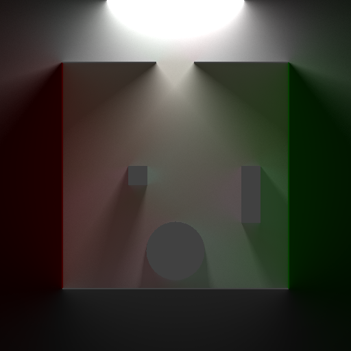

# Light2D
2D Raytracing in [Unity](https://unity3d.com/) using Signed Distance Fields

## Screenshots
   

### WIP! Documentation coming soon...

## License
This project is licensed under the MIT License - see the [LICENSE](LICENSE) file for details.

 
